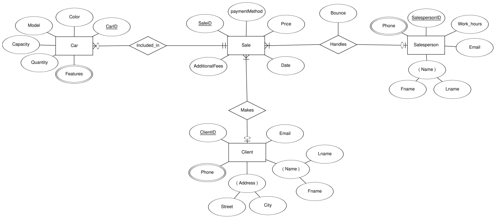
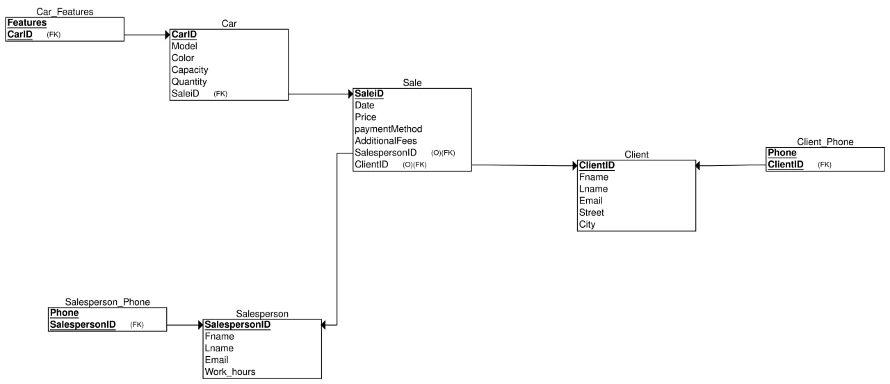
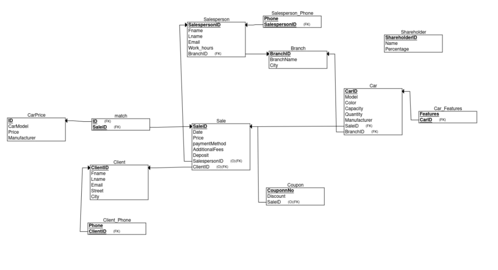
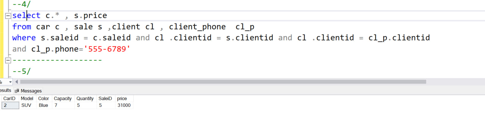
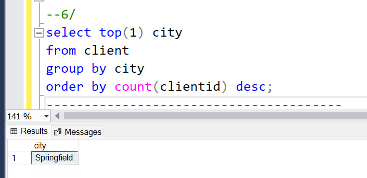
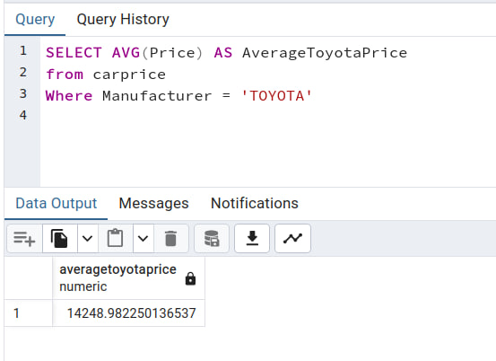
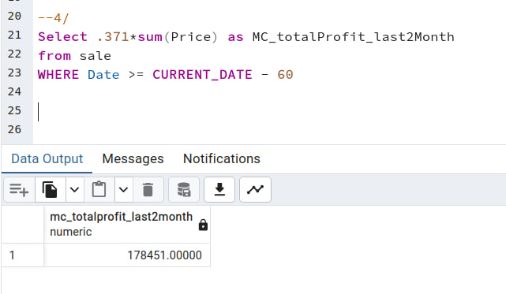
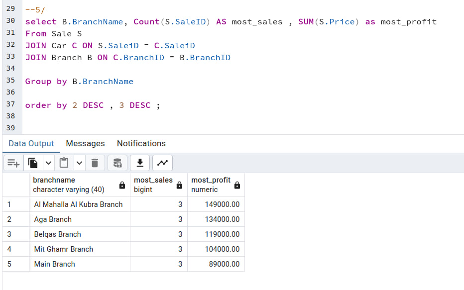

## for the initial requirements:
`the ER diagram:`



`the schema:`



## for the updated requirements:

`the ER diagram:`


`the schema:`




## queries for the initial DB:
``` sql 
-- 1/
INSERT INTO Car (CarID, Model, Color, Capacity, Quantity, SaleID) VALUES
(11, 'rino', 'black', 3, 10, null)
---------------------------
--2/
INSERT INTO Client (ClientID, Fname, Lname, Email, Street, City) VALUES
(11, 'mohamed', 'ali', 'mhmd@example.com', '1234 Elm St', 'mansoura')

INSERT INTO Sale (SaleID, Date, Price, PaymentMethod, AdditionalFees, SalespersonID, ClientID) VALUES
(11, '2024-01-15', 55000.00, ' bank account', 500.00, 2, 11)

update car 
set saleid= 11
where carid = 3 
--------------
--3/
select COUNT(distinct ClientID) as clients 
from sale 
where date >= getdate()-30 and date < getdate()
-- all the data are in 2023 so the output is 0
-------------
--4/
select c.* , s.price 
from car c , sale s ,client cl , client_phone  cl_p
where s.saleid = c.saleid and cl .clientid = s.clientid and cl .clientid = cl_p.clientid
and cl_p.phone='555-6789'
-------------------
--5/
select top (10) sp.Fname +' ' +sp.Lname  as name  
from salesperson sp ,sale s
where s.SalespersonID = sp.SalespersonID
group by  sp.Fname, sp.Lname
order by COUNT(s.saleid) desc
---5 
select name 
from(
select top (10) sp.Fname +' ' +sp.Lname  as name  , COUNT(s.saleid) as nofsales
from salesperson sp ,sale s
where s.SalespersonID = sp.SalespersonID
group by  sp.Fname, sp.Lname
order by nofsales desc
) as newtable;

--------------------------
--6/
select top(1) city 
from client 
group by city
order by count(clientid) desc;
---------------------------------------
--7/
select sum(price) 
from sale 
where date >= '01/01/2024' and date < '01/01/2025'
-- all the data are in 2023 so the output is nul
```








## queries for the updated DB:
``` sql 
--1/
SELECT AVG(Price) AS AverageToyotaPrice
from carprice
Where Manufacturer = 'TOYOTA'


--2/
Select (Price - 10000)/12 5 + 10000 as totalPay_For_5months
from carprice
where id=1 AND Manufacturer = 'LEXUS' AND Model = 'RX 450';


--3/
SELECT SUM(Price) 
from Car C
join Branch B ON C.BranchID = B.BranchID
WHERE B.City = 'Mit Ghamr';


--4/
Select .371sum(Price) as MC_totalProfit_last2Month
from sale 
WHERE Date >= CURRENT_DATE - 60


--5/ 
select B.BranchName, Count(S.SaleID) AS most_sales , SUM(S.Price) as most_profit
From Sale S 
JOIN Car C ON S.SaleiD = C.SaleiD
JOIN Branch B ON C.BranchID = B.BranchID

Group by B.BranchName

order by 2 DESC , 3 DESC ;


--6/

-- Assume the coupon number is 1001
UPDATE Sale
SET Price = Price * (SELECT Discount FROM Coupon WHERE CouponnNo = 1001)
WHERE SaleiD = (SELECT SaleiD FROM Coupon WHERE CouponnNo = 1001);

-- Then mark the coupon as used
DELETE FROM Coupon WHERE CouponnNo = 1001;


--7/

-- CURRENT MANAGER
SELECT name as CurrentManager
FrOM Shareholder
order by Percentage Desc
LIMIT 1;


-- madboli after he buy 20 %
WITH UpdatedShares AS (
    SELECT 
        Name,
        CASE 
            WHEN Name = 'Mr. Abdelfattah' THEN Percentage - 20
            WHEN Name = 'Mr. Madboli' THEN Percentage + 20
            ELSE Percentage 
        END AS UpdatedPercentage
    FROM Shareholder
)
SELECT Name AS FutureManager
FROM UpdatedShares
ORDER BY UpdatedPercentage DESC
LIMIT 1;
```








